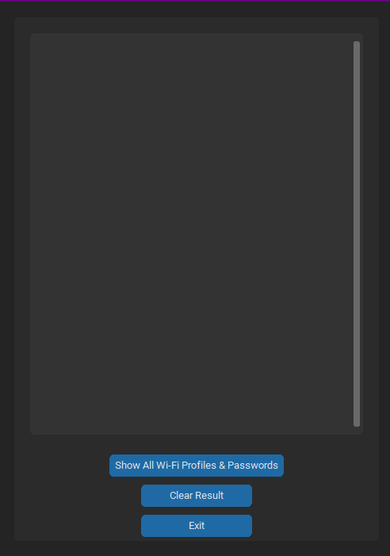
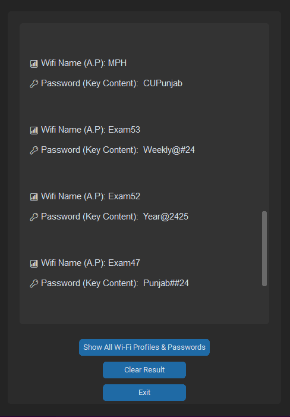

# 📡 Wi-Fi Password Extractor (GUI)

A beautiful Python GUI app that displays all saved Wi-Fi profiles and their passwords from your system using `customtkinter`.

> Built for ethical purposes and educational use only. Don't be a script kiddie. Be the script *king*.

---

## 🖼️ Screenshot





---

## 🚀 Features

- Lists all saved Wi-Fi profiles on your system
- Displays saved passwords (if any)
- Sleek and modern GUI using `CustomTkinter`
- Scrollable frame to handle long lists
- "Clear" and "Exit" buttons for smooth UX

---

## 📦 Requirements

- Python 3.6+
- `customtkinter` library
- Basic knowledge of Python's `subprocess` and `re` libraries

---

## 📥 Installation

### 1. Clone the repo

```bash
git clone https://github.com/CYBERSAREEN/wifi-password-extractor.git
cd wifi-password-extractor
```

### 2. Install `customtkinter`

```bash
pip install customtkinter
```

---

## ▶️ Usage

```bash
python wifi_extractor.py
```

That’s it. The GUI will pop up, and with one click, you’ll see all saved Wi-Fi profiles and their passwords.

---

## 🧠 How It Works (for the curious nerds)

* Uses `subprocess` to run:
  ```bash
  netsh wlan show profiles
  netsh wlan show profile name="PROFILE_NAME" key=clear
  ```
* Parses the results using `re` (regular expressions)
* Displays Wi-Fi names and passwords in a clean GUI with `CustomTkinter`

---

## 🔒 Disclaimer

This tool is meant **only for educational** and  **personal recovery purposes** .

**Do not** use it on devices or networks you do not own or have explicit permission to access.

Violating ethical or legal boundaries can get you into serious trouble. Don't be that guy.

---

## 💡 Contributions

Found a bug? Got an idea? Pull requests are welcome.

---

## 🧙 Author

**Vedant Sareen**

Passionate about cybersecurity, Python, and making tools that don’t suck.

---

## ⭐️ Give a Star

If you like this project or found it useful, consider giving it a ⭐️. It helps the repo grow and makes the dev (me 😎) happy!
